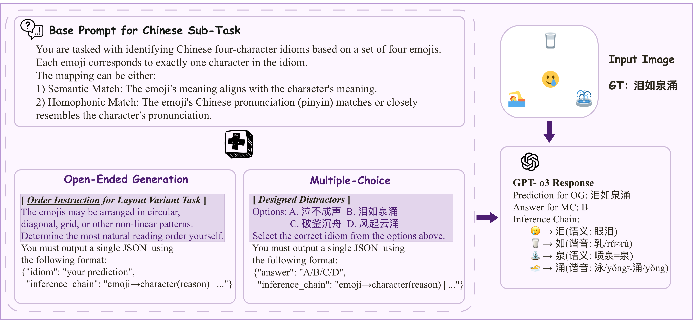
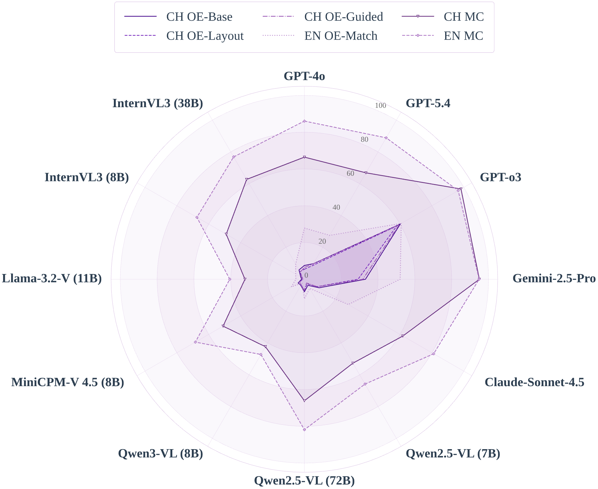
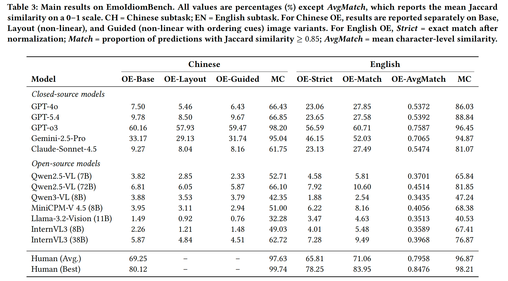

<h1 align="center">🎨 EmoIdiomBench 🔖</h1>

<p align="center">
  <strong>A Bilingual Benchmark for Figurative Reasoning and Spatial Visual Parsing in MLLMs</strong>
</p>

<p align="center">
  </a>
  <a href="https://github.com/Oliveeez/EmoIdiomBench-ACM-MM-2026/tree/main/data/raw_data">
  
  <a href="https://github.com/Oliveeez/EmoIdiomBench-ACM-MM-2026/tree/main/data">
  
  <a href="https://2026.acmmm.org/">
</p>

---

## 📌 Overview

**EmoIdiomBench** is a large-scale bilingual (Chinese + English) multimodal benchmark that evaluates Multimodal Large Language Models (MLLMs) on two dimensions:

1. **Figurative Reasoning** — decoding culturally rooted idioms from rendered emoji images via semantic, homophonic, and metaphorical mappings.
2. **Spatial Visual Parsing** — interpreting emojis under non-linear spatial layouts (grid, diagonal, star, etc.) with or without explicit ordering cues.

The benchmark adopts a dual **Open-Ended Generation (OE) / Multiple-Choice (MC)** evaluation protocol, exposing a critical "generative aphasia" in current MLLMs: most models can passively verify visual-textual alignments under MC, yet fundamentally fail to actively construct cross-modal reasoning paths under OE.

<p align="center">
  
</p>

## ✨ Highlights

- 🌏 **Bilingual**: 3,333 Chinese four-character idioms + 1,210 English idioms.
- 🖼️ **17,875 rendered images** using the open-source Twemoji set on 1024×1024 canvases.
- 🔬 **Controllable construction**: Chinese subtask uses a pinyin-indexed B⁺ tree with enumerable homophonic substitution ratios (88.59% of idioms require ≥1 homophonic mapping).
- 📐 **Spatial layout variants**: Base / Layout (non-linear) / Guided (with arrows or numerical labels) for the Chinese subtask.
- 📝 **Dual OE/MC protocol**: Systematically contrasts generative and discriminative abilities.
- 🏆 **12 MLLMs evaluated**: Including GPT-o3, GPT-5.4, Gemini-2.5-Pro, Claude-Sonnet-4.5, Qwen2.5-VL, InternVL3, and more.

## 📂 Repository Structure

```
EmoIdiomBench-ACM-MM-2026/
├── data/
│   ├── chinese_variants/                        # Chinese subtask images
│   │   ├── 1_一丘之貉/                           # One folder per idiom: {id}_{idiom}
│   │   │   └── 1/                               # Variant set index
│   │   │       ├── 一丘之貉_base_v001.png        # Base: standard left-to-right layout
│   │   │       ├── seq_varients_pure/            # Layout variants (no ordering cues)
│   │   │       │   ├── 一丘之貉_diagonal_v002.png
│   │   │       │   └── 一丘之貉_zigzag_v003.png
│   │   │       └── seq_varients_with_guideance/  # Guided variants (arrows / labels)
│   │   │           ├── 一丘之貉_diagonal_guide_only_v004.png
│   │   │           └── 一丘之貉_zigzag_numbers_only_v005.png
│   │   ├── 2_.../
│   │   └── ...
│   ├── english_variants/                        # English subtask images (Base only)
│   │   ├── 1_trade_off/
│   │   │   └── trade_off_base.png
│   │   ├── 2_give_me_a_break/
│   │   │   └── give_me_a_break_base.png
│   │   └── ...
│   └── raw_data/                                # Source annotation files (JSON)
│       ├── chinese_idioms.json
│       ├── english_idioms.json
│       ├── chinese_mc_options.json
│       └── english_mc_options.json
├── images/                                      # Figures used in this README
├── README.md                                    # This file (English)
├── README_zh.md                                 # 中文版 README
└── LICENSE
```

## 📊 Dataset Statistics

| | Chinese | English |
|---|---|---|
| Idioms | 3,333 | 1,210 |
| Emojis per instance | 4 (fixed) | 2–10 (avg. 2.79) |
| Mapping types | Semantic + Homophonic | Semantic + Metaphor |
| Homophonic rate | 88.59% | N/A |
| Image variants / idiom | 5 (Base ×1, Layout ×2, Guided ×2) | 1 (Base only) |
| Total images | 16,665 | 1,210 |
| **Total** | **4,543 idioms / 17,875 images** | |

## 🔧 Data Format

Each entry in the Chinese JSON annotation file follows this schema:

```json
# data/raw_data/chinese_idiom_with_distractors_index1.json
{
    "idiom_index": 1557,
    "idiom": "怒火中烧",
    "emoji_rep": [
        {
            "index": 1,
            "emoji_set": "💢🔥⏰🥄",
            "homophonic_num": 2
        }
    ],
    "distractors": [
        "心急如焚",
        "妒火中烧",
        "走马观花",
        "恼羞成怒"
    ]
}
```

| Field | Description |
| --- | --- |
| `idiom_index` | Unique integer ID for the idiom |
| `idiom` | Target four-character Chinese idiom |
| `emoji_rep` | List of emoji representation variants. Each contains an `index` (variant ID), `emoji_set` (the four rendered emojis), and `homophonic_num` (number of homophonic substitutions in this variant) |
| `distractors` | Four MC options for the multiple-choice setting |

The corresponding images are stored under `data/chinese_variants/{idiom_index}_{idiom}/{variant_index}/` with Base, Layout, and Guided sub-files as described in the repository structure above.

The English JSON annotation file follows a similar schema:
```json
# data/raw_data/english_Idiom_with_distractors.json
{
    "idiom_index": 3,
    "idiom": "swan song",
    "emoji_rep": [
        {
            "emoji_set": "🦢🎵"
        }
    ],
    "distractors": [
        "call it a day",
        "for a song",
        "spill the beans",
        "throw in the towel"
    ]
}
```

The corresponding images are stored under `data/english_variants/{idiom_index}_{idiom}/` with a single Base image.

## 📈 Benchmark Results

### Main Results
<p align="center">
  
</p>

<p align="center">
  
</p>

### Key Findings

1. **Generative Aphasia**: Massive OE↔MC gap across all models (e.g., Qwen2.5-VL-72B: 6.81% OE vs. 66.10% MC on Chinese).
2. **Phonetic Reasoning Bottleneck**: Chinese homophonic mappings cause severe failures — models cannot perform "visual → phonetic → linguistic" multi-hop reasoning.
3. **Spatial Parsing Deficiency**: Non-linear layouts degrade performance, and guided cues (arrows/labels) are sometimes treated as semantic noise rather than instructional aids.
4. **Human Gap**: Even GPT-o3 (60.16%) significantly trails human average (69.25%) and expert ceiling (80.12%) on Chinese OE-Base.


### Prompt Templates

We provide the exact prompt templates used in our evaluation in the paper. Models are instructed to output structured JSON with `inference_chain` and `predicted_idiom` (OE) or `predicted_answer` (MC). See **Section 4.1** of the paper for full implementation details.

## 📋 Evaluation Metrics

| Setting | Metric | Description |
|---|---|---|
| Chinese OE | Exact Match | Predicted idiom must exactly match the target |
| English OE | Strict Accuracy | Exact match after normalization |
| English OE | Match Accuracy | Character-level Jaccard similarity ≥ 0.85 |
| English OE | AvgMatch | Mean character-level Jaccard similarity |
| MC (both) | Accuracy | Correct option selected from 4 choices |


## 🙏 Acknowledgments

We thank all annotators who participated in the human curation and evaluation. We also thank the developers of [Twemoji](https://github.com/twitter/twemoji) for the open-source emoji assets, and [DeepSeek-R1](https://github.com/deepseek-ai/DeepSeek-R1) for powering parts of our construction pipeline.

## 📬 Contact

For questions or suggestions, please open an issue or contact:

- **Zijiao Zhang** — [zijiao.zhang@sjtu.edu.cn](mailto:zijiao.zhang@sjtu.edu.cn)
- **Renqiu Xia** (Corresponding) — [xiarenqiu@sjtu.edu.cn](mailto:xiarenqiu@sjtu.edu.cn)
- **Junchi Yan** (Corresponding) — [yanjunchi@sjtu.edu.cn](mailto:yanjunchi@sjtu.edu.cn)